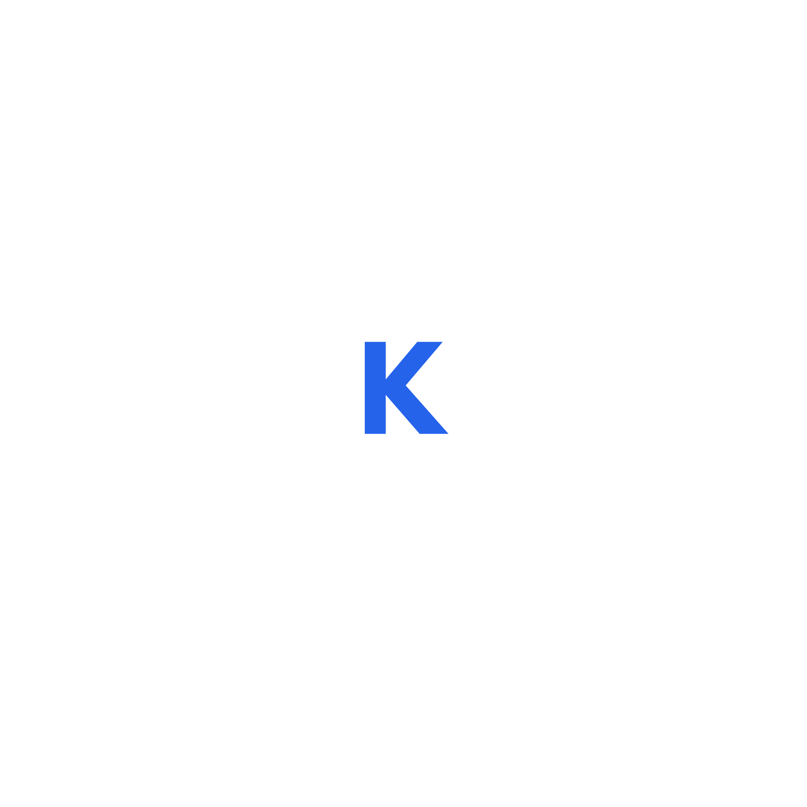

# 🎨 Portfolio Identity Kit

## Typography

### Heading Font
**Space Grotesk**

### Body Font
**Inter**

---

## Color Palette

| Purpose | Color | Hex Code |
|---------|-------|----------|
| Primary | Blue | `#2563EB` |
| Text | Near Black | `#111827` |
| Background | Near White | `#F9FAFB` |
| Accent | Emerald Green | `#10B981` |

---

## Logo / Favicon

Use a simple **K** monogram created with the **Space Grotesk** font.

**Design Notes**
- Font: Space Grotesk Bold
- Text Color: `#2563EB`
- Background: `#F9FAFB`
- Style: Minimal and clean

---

## Style Note

**Fonts:** Space Grotesk for headings and Inter for body text. Colors: `#2563EB`, `#111827`, `#F9FAFB`, and `#10B981`.

**Mood:** Clean, modern, and professional with a calm color palette that keeps the focus on projects and case studies.

---

## ✅ Assignment Checklist

- [x] One heading font (Space Grotesk)
- [x] One body font (Inter)
- [x] Four-color palette with hex codes
- [x] Simple KA logo/favicon
- [x] Two-line style note
- [x] Identity kit presented on a single page